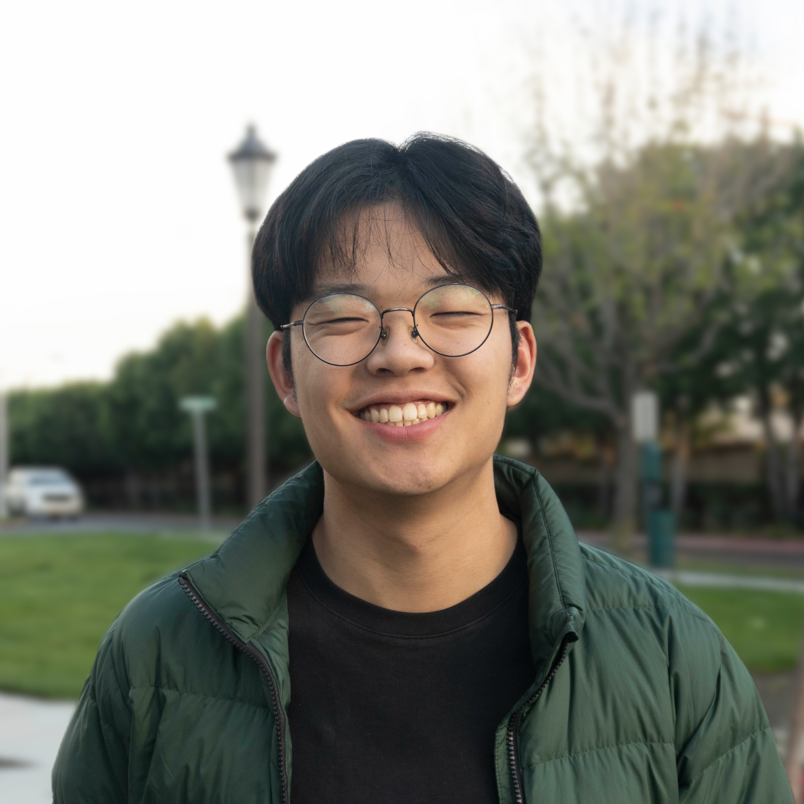
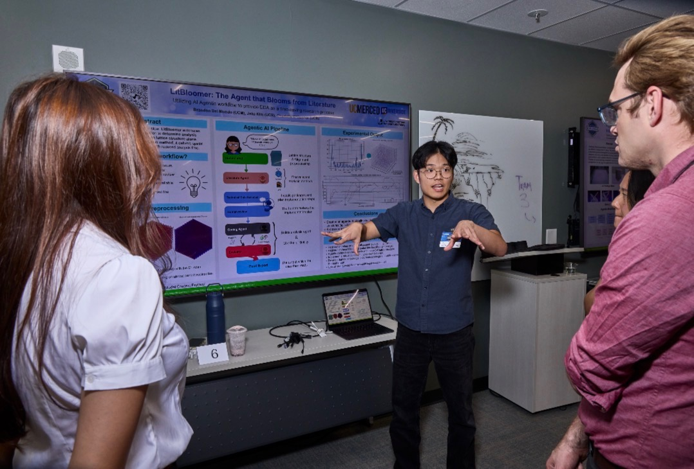
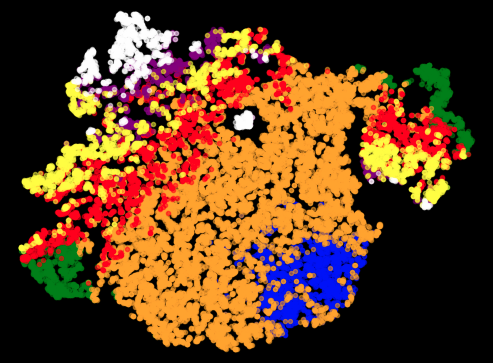
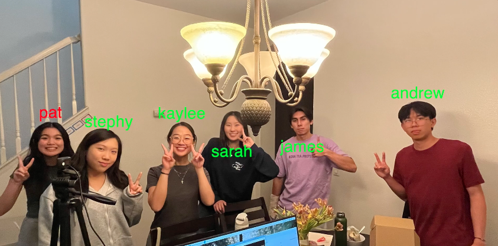
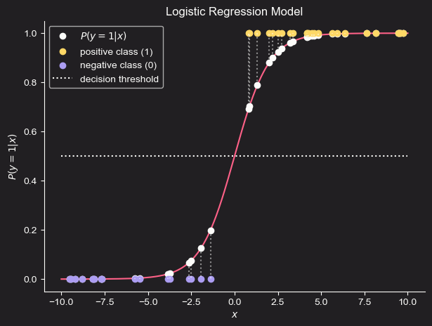
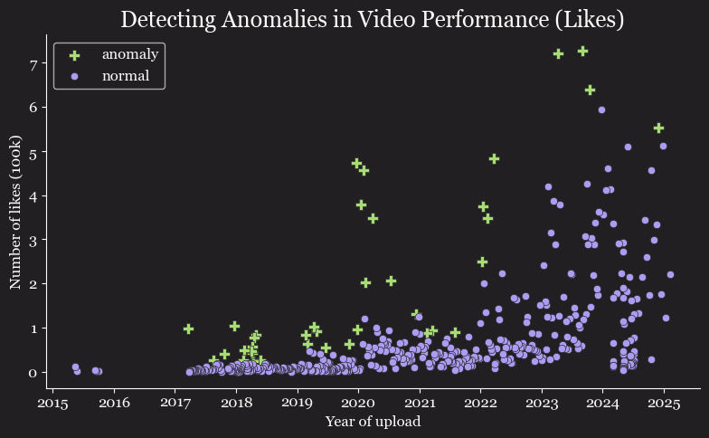

  
  
  <h1>Jake Kim</h1>
  <h3>MS Student @ UC San Diego</h3>
  
  

    <a href="https://www.linkedin.com/in/jake-j-kim">LinkedIn</a> &nbsp;&bull;&nbsp; 
    <a href="mailto:jak098@ucsd.edu">Email</a> &nbsp;&bull;&nbsp;
    <a href="https://github.com/jakecreate">Github</a>
  

## 👋 About Me

Critical sectors such as healthcare, finance, and law increasingly integrate Large Language Models (LLMs) into diverse workflows, ranging from conversational tools to autonomous agents. Regardless of whether current systems approach artificial general intelligence, deployed LLM agents can create real-world risks if their failure modes remain unaddressed. This challenge motivates my work: I want to help make AI systems safer, more reliable, and better understood.

I am currently a first-year graduate student in Computer Science at UC San Diego. My academic focus centers on representation learning, and I am exploring mechanistic interpretability to better understand how internal network representations function. My goal is to build strong foundations both as a machine learning engineer and as a researcher. I am actively seeking roles in machine learning engineering, data science, and research (both foundational and applied) across industry and academic labs.

Outside of technical work, I play chess, read books on human psychology, love to hike, and sing.

---

## 💼 Experience

<table>
  <tr>
    <td width="25%" align="center">
      
    </td>
    <td width="75%">
      <h3>Data Science Challenge Intern</h3>
      <h4>Lawrence Livermore National Lab &nbsp;|&nbsp; July 2026 </h4>
      
I lived in Livermore for an intensive two-week challenge, collaborating in a team of three to automate the analysis of additively manufactured lattice structures. Working with 3D CT scan data from the Additive Manufacturing Laboratory (AML), we designed <b>LitBloomer</b>—an autonomous multi-agent pipeline that retrieves relevant literature and generates tailored exploratory data analysis workflows for each sample. We concluded the program by presenting and defending our findings during a poster session evaluated by laboratory research scientists.

      
<b>Tools & Tech:</b> <i>Codex CLI, FastMCP, Python</i>

    </td>
  </tr>
</table>

<table>
  <tr>
    <td width="25%" align="center">
      
    </td>
    <td width="75%">
      <h3>Undergraduate Research Assistant</h3>
      <h4>Motion Planning Lab @ UC Riverside &nbsp;|&nbsp; June 2025 – October 2025</h4>
      
Under the mentorship of Prof. Ioannis Karamouzas, I pursued to find representations for multi-agent motion. I built a custom PyTorch autoencoder to perform non-linear dimensionality reduction on spatiotemporal sequence data from normalized NBA player trajectories. By projecting these sequences into a lower-dimensional latent space, I discovered structured in the latent space that revealed clusters of distinct movement patterns, directly motivating a PhD student in the lab to pursue latent-space clustering for her research.

      
<b>Tools & Tech:</b> <i>PyTorch, Python, Autoencoders, NumPy, Git</i>

    </td>
  </tr>
</table>

---

## 🚀 Featured Projects

<table>
  <tr>
    <td width="40%">
      
    </td>
    <td width="60%">
      <h3><a href="https://github.com/jakecreate/proactive-edge-attendance-tracker">Proactive Edge Attendance Tracker</a></h3>
      
This project is a computer vision system that automates attendance logging for classrooms and workplaces. The application processes video locally on edge hardware. It tracks entries in real time, reduces network latency, and protects user privacy (CS 131 Project @ UC Riverside).

      
<b>Tech Stack:</b> <i>Python, OpenCV, Rasberry-Pi, MobileFaceNet</i>

    </td>
  </tr>

  <!-- Project 2: Machine Learning From Scratch -->
  <tr>
    <td width="40%">
      
    </td>
    <td width="60%">
      <h3><a href="https://github.com/jakecreate/machine-learning-from-scratch">Machine Learning From Scratch</a></h3>
      
This repository contains fundamental machine learning algorithms built without high-level frameworks. It includes custom code for optimization, loss calculation, and more. I built this project to develop a deep understanding of core model mechanics.

      
<b>Tech Stack:</b> <i>Python, NumPy, Matplotlib, Linear Algebra</i>

    </td>
  </tr>

  <!-- Project 3: YouTube Data Analysis -->
  <tr>
    <td width="40%">
      
    </td>
    <td width="60%">
      <h3><a href="https://github.com/jakecreate/youtube_data_analysis">YouTube Data Analysis: Outdoor Boys</a></h3>
      
This is a starter project to apply introductory exploratory data analysis (EDA) methods to my favorite YouTube channel, Outdoor Boys. The project examines view counts, video length, and upload patterns. It serves as an introduction to data extraction, data cleaning, and data visualization.

      
<b>Tech Stack:</b> <i>Python, Pandas, Matplotlib, Exploratory Data Analysis</i>

    </td>
  </tr>
</table>

---

## 📬 Let's Connect

I welcome discussions on machine learning research, engineering opportunities, and technical projects.

Contact me by [Email](mailto:developjake@gmail.com) or connect on [LinkedIn](https://www.linkedin.com/in/jake-j-kim).